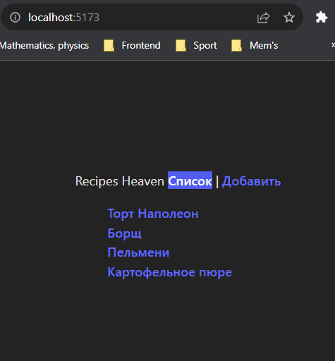

## React-router

  

С помощью React Router реализована маршрутизация на странице.

 

 

-   При клике на одно из блюд происходит роутинг на страницу с рецептом. **Ререндеринг** всей страницы **не** происходит, а заменяется только один компонент на странице. 
-   При переходе по сслыке с несуществующим путём - происходит роутинг на страницу **404** (содержащая в себе ссылку на главную страницу).

Так же предусмотрена ситуация, при которой необходимо произвести **редирект** со старого url-адреса 